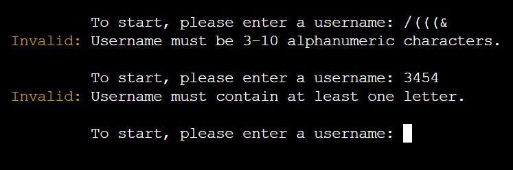
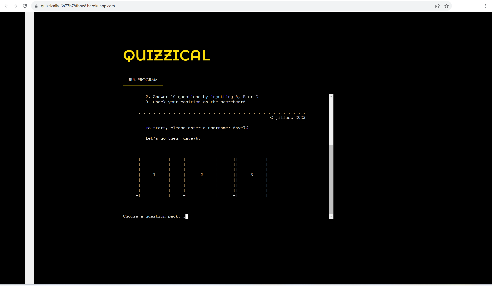
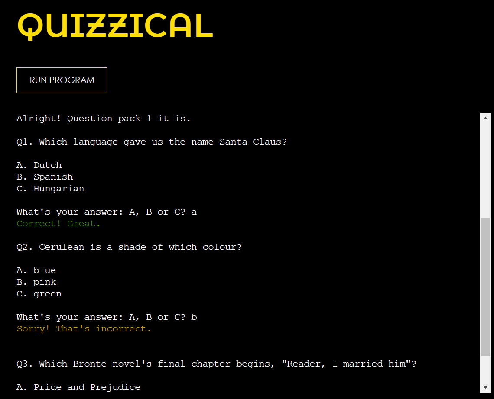
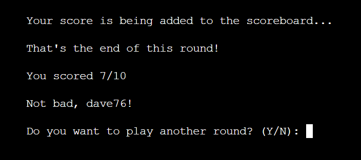
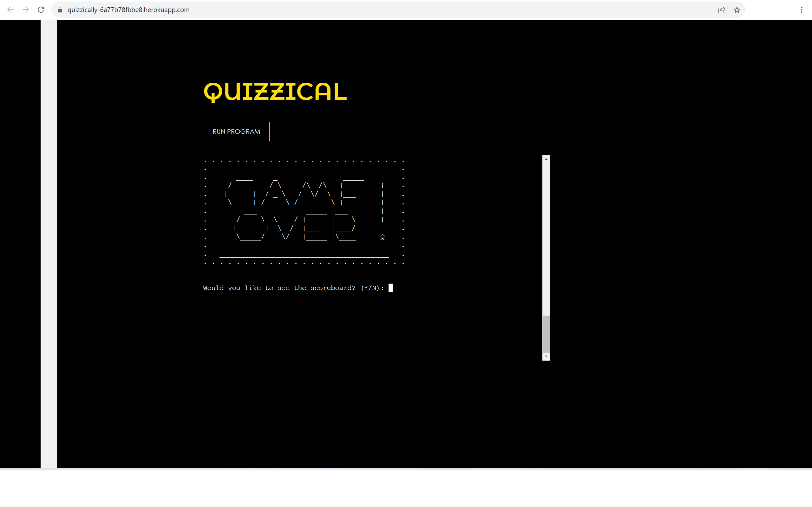
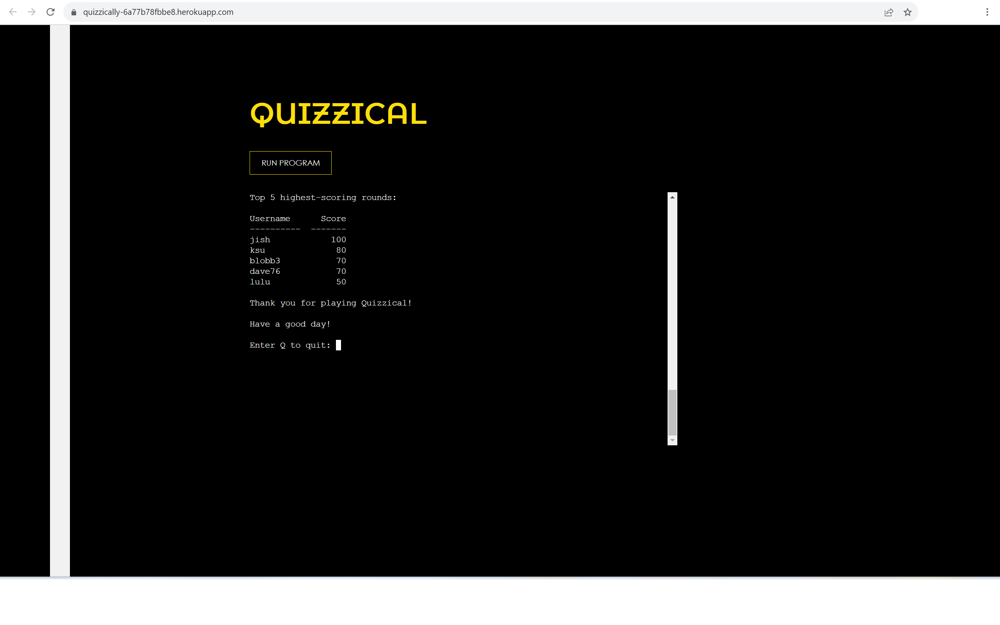
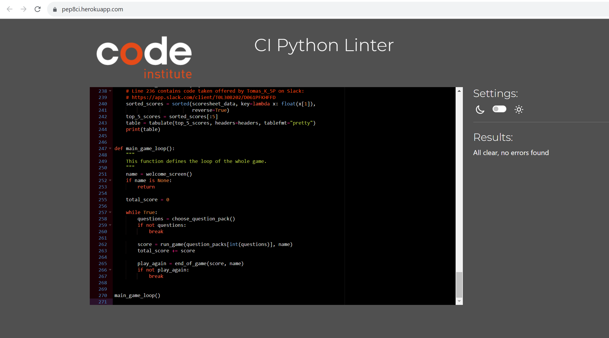

# QU!ZZ!CAL

Quizzical is a terminal-based multiple-choice quiz game written in Python.

Players test their knowledge across three rounds of general knowledge questions, receive immediate feedback on their answers and have their scores recorded in a Google Sheets leaderboard.

Originally created as a study project in 2023, Quizzical has since been updated to run locally using a modern Node.js environment while preserving the original gameplay and Google Sheets integration.


---

## How it works

The player is prompted to enter a username, which is used to record their score on the leaderboard.

Three question packs are available. After completing a round, the player can choose to continue with another pack or finish the game.

Each question presents three possible answers. The player selects their answer by entering **A**, **B** or **C** on their keyboard.

After each answer, feedback is given. Incorrect answers do not reveal the correct option, encouraging players to replay and improve their score.

At the end of the game, the player's score is stored in a Google Sheets database. The player can then view a leaderboard displaying the five highest scores.

---

## Features

### Current features

- Welcome screen with title graphic.


- Username entry with input validation.
- Comprehensive error handling for invalid input.



- Selection of three different question packs.



- Questions are randomly shuffled each time a pack is played.
- Ten multiple-choice questions per round.
- Immediate feedback after each answer.



- Score displayed at the end of each round.
- Option to continue playing another question pack.



- Game over screen with optional leaderboard.



- Top five leaderboard stored in Google Sheets.



- Google Sheets integration using the **gspread** library.
- Scoreboard displayed in the terminal using the **tabulate** library.

Google Sheet:
https://docs.google.com/spreadsheets/d/14aBiAc2JxeRauvC3_H2hoN2Nm3y-RgxoWKx92Rbr--I/edit?usp=sharing

---

## Technologies

- Python
- Node.js
- Total.js
- Google Sheets API
- gspread
- tabulate

---

## Running locally

Clone the repository:

```bash
git clone https://github.com/jillusc/QUIZ.git
```

Install the Node.js dependencies:

```bash
npm install
```

Install the Python dependencies:

```bash
pip install -r requirements.txt
```

Create a `creds.json` file containing your Google service account credentials.

Start the application:

```bash
node index.js
```

The application will then be available at:

```
http://localhost:8000
```

---

## Future improvements

- Allow players to accumulate a total score across all three question packs.
- Display each question on a freshly cleared terminal.
- Calculate and display scores as percentages.
- Prevent duplicate usernames.
- Add additional themed question packs.
- Randomise the answer order as well as the questions.

---

## Design

The interface was intentionally kept clean and uncluttered to resemble a traditional terminal application.

- Black background with a centred terminal.
- Gold title text for contrast.
- Google Font used for the title.
- Subtle vertical stripe added to balance the page visually alongside the scrollbar.

---

## Testing

### Bugs resolved

- Long questions wrapped awkwardly in the terminal and were reformatted.
- Scoreboard updates were corrected by ensuring scores are written before being displayed.
- Screen clearing was adjusted so that important messages remain visible long enough to be read.

### Known limitations

The first three items listed under **Future improvements** remain planned enhancements.

### Validation

The Python code passes linting without errors.



---

## Credits

### Resources

- Code Institute's original terminal project.
- Google Sheets API
- gspread
- tabulate

### Inspiration

Some Python techniques were inspired by the Code Institute learning materials before being adapted for this project.

Additional troubleshooting and modernisation of the project for local development was carried out with assistance from ChatGPT.
